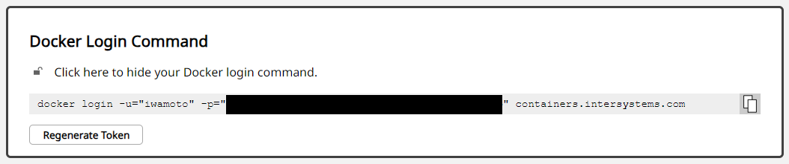

# 更新履歴
2023/9 IRIS2023.2+IKO3.6にバージョンアップ。AKSクラスタ作成手順を簡素化。

# 実行に際して
StatefulSetを使用したデプロイは、Community版を使用しますので、どなたでも実行可能です。  
InterSystems Kubernetes Operatorは製品版IRISを使用するため、有効なWRCアカウントが必要となります。

以下のことを実行します。
1. AKS クラスタの作成
2. StatefulSetを使用したバニラIRISの起動
3. IKOを使用したバニラIRISの起動
4. IKOを使用したIRISベースの独自イメージの起動

# 事前作業
## 事前作業(必須)

事前作業を実施する環境として、azを実行可能なLinux環境をご用意ください。

私は[こちらの手順](https://learn.microsoft.com/ja-jp/cli/azure/install-azure-cli-linux?pivots=apt)で、WSL2上のUbuntu22.04で実行しています。

1. Git クローン
    ```bash
    $ git clone https://github.com/IRISMeister/iris-k8s-vs2021.git
    $ cd iris-k8s-vs2021
    ```

2. docker, az cli, kubectlのインストール  

    ```
    $ docker version
    Client: Docker Engine - Community
    Version:           24.0.5
    API version:       1.43
    Go version:        go1.20.6
    Git commit:        ced0996
    Built:             Fri Jul 21 20:35:18 2023
    OS/Arch:           linux/amd64
    Context:           default

    Server: Docker Engine - Community
    Engine:
    Version:          24.0.5
    API version:      1.43 (minimum version 1.12)
    Go version:       go1.20.6
    Git commit:       a61e2b4
    Built:            Fri Jul 21 20:35:18 2023
    OS/Arch:          linux/amd64
    Experimental:     false
    containerd:
    Version:          1.6.21
    GitCommit:        3dce8eb055cbb6872793272b4f20ed16117344f8
    runc:
    Version:          1.1.7
    GitCommit:        v1.1.7-0-g860f061
    docker-init:
    Version:          0.19.0
    GitCommit:        de40ad0
    ```

    ```
    $ az version
    {
    "azure-cli": "2.51.0",
    "azure-cli-core": "2.51.0",
    "azure-cli-telemetry": "1.1.0",
    "extensions": {}
    }
    ```
    [こちらの手順](https://learn.microsoft.com/ja-jp/cli/azure/install-azure-cli-linux?pivots=apt)を使用しました。

    ```bash
    $ sudo az aks install-cli 
    $ kubectl version
    Client Version: v1.28.1
    Kustomize Version: v5.0.4-0.20230601165947-6ce0bf390ce3
    Server Version: v1.26.6
    WARNING: version difference between client (1.28) and server (1.26) exceeds the supported minor version skew of +/-1
    ```

    > sudo を付けないとWindows用のEXEがインストールされてしまうようです

3. IRISパスワードの設定

    IRIS用のPassword Hashの作成及び定義への反映を行います。  

    [公式ドキュメント](https://docs.intersystems.com/iris20201/csp/docbookj/Doc.View.cls?KEY=ADOCK#ADOCK_iris_images_password_auth)

    ```bash
    $ docker run --rm -it containers.intersystems.com/intersystems/passwordhash:1.1
    Enter password:
    Enter password again:
    PasswordHash=34e80d2f1ad5135679b3a57a9c4b1611a8a8995e0849ebe954ac1c16ad253d0274296985fea058a8aaf2a149b88082595e6374b3c2f7d5f0774f05e4311ba52d,124e81ee6bf17fcaf0dfb38a4f8a7f46e9e4b0c8c9a40864bb189d4d200b161b1451874efcbed63b801cbab592434b93037e90810d96e4ee123ac03b756779e9,10000,SHA512

    ```
    PasswordHash=xxxxxの箇所を、[iris-configmap-cpf.yaml](yaml/iris-configmap-cpf.yaml)に上書きします。  
    初期設定されているハッシュ値はパスワードSYSを指定して作成したものです。
    
## 事前作業(IKO使用時)
IKOを使用する場合は、上記に加えて下記の作業が必要になります。

1. コンテナイメージ取得用のクレデンシャル情報

    IKOおよび製品版IRISのコンテナイメージの取得には、ICRレポジトリへのログインが必要です。

    > ここではローカルでdocker loginした情報(~/.docker/config.json)を一括で使用する方法を採用します。
    > この情報は、[prep-iris-cluster.sh](shell/prep-iris-cluster.sh)で使用されます。

    製品版IRISおよびIKOのコンテナイメージの取得にはWRCアカウントへのログインが必要です。

    https://container.intersystems.com/ にWRCアカウントでログインしてください。
    
    

    得られたdocker loginコマンドをローカルで実行してください。

2. IKOのインストーラ(HELM chart)入手  

    [公式ドキュメント](https://docs.intersystems.com/components/csp/docbook/DocBook.UI.Page.cls?KEY=AIKO#AIKO_archive)

    IKOを試される場合は、ご面倒ですが、IKOのキット(tar)をWRCから入手してください。
    今回使用するのは、Software Distribution -> Components下にあるInterSystems Kubernetes Operator(AMD) (iris_operator_amd-3.6.7.100-unix.tar.gz)です。  
    解凍したtarのchartフォルダをgit cloneしたフォルダに移動してください。

    ```
    $ pwd
    /home/irismeister/git/iris-k8s-vs2021
    $ tar -xvf ./iris_operator_amd-3.6.7.100-unix.tar.gz
    $ mv iris_operator_amd-3.6.7.100/chart .
    ```

    下記のような構造になるはずです。

    ```
    $ tree chart/
    chart
    └── iris-operator
        ├── Chart.yaml
        ├── README.md
        ├── templates
        │   ├── NOTES.txt
        │   ├── _helpers.tpl
        │   ├── apiregistration.yaml
        │   ├── appcatalog-user-roles.yaml
        │   ├── cleaner.yaml
        │   ├── cluster-role-binding.yaml
        │   ├── cluster-role.yaml
        │   ├── deployment.yaml
        │   ├── mutating-webhook.yaml
        │   ├── service-account.yaml
        │   ├── service.yaml
        │   ├── user-roles.yaml
        │   └── validating-webhook.yaml
        └── values.yaml

    2 directories, 16 files
    ```
3. HELM(V3)のインストール  

    ```bash
    $ curl https://raw.githubusercontent.com/helm/helm/master/scripts/get-helm-3 | bash
    ```

4. 評価ライセンスキーの入手  
IKOを使用して、ECP,Shard,ミラーを構成する場合、製品版のIRISとライセンスキーが必要です。
IKOを試される場合は、ご面倒ですが、Shard及びミラーが有効なコンテナバージョン用のIRIS評価ライセンスキーを入手して、~/に配置してください。以後、このファイルは取り扱い注意です(間違ってpublicなレポジトリにpushしないよう)。

> ECP,Shard,ミラーなどを使用しない場合、IKOを使ってIRISコミュニティエディションをプロビジョンすることも可能です。

5. IRISパスワードの設定 

    [common.cpf](cpf/common.cpf)にパスワードハッシュ値を反映します。  

## 事前作業(独自=非公開イメージ使用時)

独自イメージを使用する場合は、上記に加えて独自イメージを取得するためのクレデンシャル情報が必要になります。

ローカル環境で、docker loginを実行してください。

> この情報は、[prep-iris-cluster.sh](shell/prep-iris-cluster.sh)で使用されます。

# AKSクラスタの作成

ここまでを事前に一度だけ実行しておき、以降は再利用するのが便利です。  
**ここ以降はAzureでコストが発生する操作を含みます。**


```bash
$ az login
$ shell/aks-create-aks-cluster.sh
```
> 10分程度、時間がかかります

```bash
$ kubectl get node
NAME                                STATUS   ROLES   AGE     VERSION
aks-ingest-37009370-vmss000000      Ready    agent   4m44s   v1.26.6
aks-iris-24535832-vmss000000        Ready    agent   10m     v1.26.6
aks-iris-24535832-vmss000001        Ready    agent   11m     v1.26.6
aks-iris-24535832-vmss000002        Ready    agent   11m     v1.26.6
aks-nodepool1-12185897-vmss000000   Ready    agent   17m     v1.26.6
aks-query-13338479-vmss000000       Ready    agent   2m44s   v1.26.6
aks-ui-39448977-vmss000000          Ready    agent   6m37s   v1.26.6
```

# Demo内容
[demo.md](docs/demo.md)を参照ください。

デモでは、下記を実行します。
- バニラIRIS(Community Edition)をDeploymentとしてデプロイ(スタンドアロン構成)
- バニラIRIS(Community Edition)をStatefulSetとしてデプロイ(スタンドアロン構成)
- IKOのインストール
- IKOを使用したバニラIRIS(製品版)のデプロイ(Mirror,ECP構成。WGWサイドカー,スタンドアロンWGW)
- IKOを使用したユーザ作成イメージのデプロイ(Mirror,ECP構成。WGWサイドカー,スタンドアロンWGW)

# 削除
## Demo開始前の状態に戻す
(Demo内容)を初期状態から再実行するには、下記を実行してください。Demo.txtで作成したリソースを全て削除します。
```bash
shell/reset-to-next-demo.sh
```
> 再度Demo.txtの操作を行った場合、イメージがK8s環境にpullされているので、初回に比べてPODの起動が早くなります。

# SpeedTest

[SpeedTest](https://github.com/intersystems-community/irisdemo-demo-htap)をAKSで稼働させることが出来ます。手順は[こちら](./speedtest/README.md)です。


## AKSクラスタを完全に削除
AKSクラスタを完全に削除するには下記を実行してください。
```bash
source shell/envs.sh
az group delete --name $aksrg --yes --no-wait
```

念のため、Azureのポータルで、下記のリソースグループが削除(もしくは内容が空)されていることを確認してください。
```bash
az group list --query "[?name=='iris-aks-rg']"
[]
```

次回は、「AKSクラスタの作成」から再実行できます。

# IKOの動作
これを見れば、IKOが実際に何を行っているのかを知ることができます。

## IKOによるCPFの上書き設定内容
下記コマンドで、IKOが実施したcpf mergeの内容を確認することが出来ます。
```bash
$ kubectl describe cm iris-vs2021-data-0
$ kubectl describe cm iris-vs2021-compute
```

[iris-vs2021-data-0の内容](iko-cm/data-0.txt)

[iris-vs2021-computeの内容](iko-cm/compute-0.txt)

## IKOによるKubernetesの操作
下記コマンドで、IKOが作成したPODやServiceのyamlを出力することができます。

```bash
$ kubectl get pod iris-vs2021-data-0-0 -o yaml > export/data-0-0.yml
$ kubectl get pod iris-vs2021-data-0-1 -o yaml > export/data-0-1.yml
$ kubectl get pod iris-vs2021-compute-0 -o yaml > export/compute-0.yml
$ kubectl get statefulset iris-vs2021-data-0 -o yaml > export/data-0.statefulset.yaml
$ kubectl get svc iris-vs2021 -o yaml > export/svc.yaml
```
