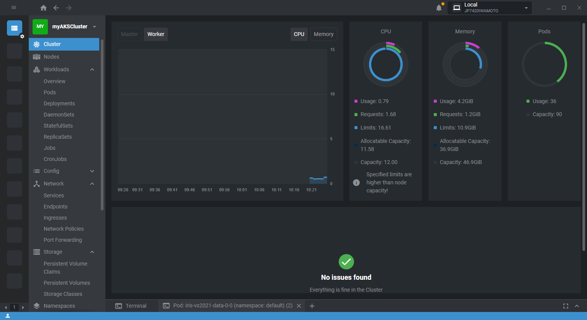
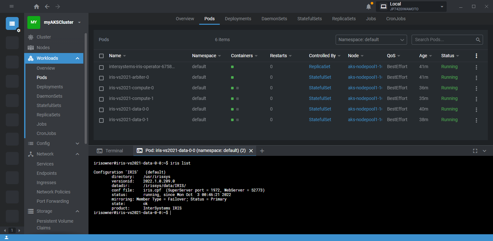

# 実行に際して
StatefulSetを使用したデプロイは、Community版を使用しますので、どなたでも実行可能です。  
InterSystems Kubernetes Operatorは製品版IRISを使用するため、有効なWRCアカウントが必要となります。

# 事前作業
## 事前作業

事前作業を実施する環境として、Ubuntu20.04をご用意ください。
1. az cli, kubectlのインストール  

    az cli
    ```bash
    $ curl -sL https://aka.ms/InstallAzureCLIDeb | sudo bash
    ```
    kubectl
    ```bash
    $ sudo az aks install-cli
    ```

2. サービスプリンシパル作成  
アプリケーション実行用のID(aks用のサービスプリンシパル)を作成します。出力値は取り扱い注意です。

    ```bash
    $ az login   (ブラウザ経由での認証を実行)
    $ az ad sp create-for-rbac --skip-assignment
    {
    "appId": "xxxxxxxxxx",
    "displayName": "azure-cli-2020-10-26-03-51-23",
    "name": "http://azure-cli-2020-10-26-03-51-23",
    "password": "yyyyyyyyyy",
    "tenant": "zzzzzzzzzz"
    }
    ```

3. envs.shの編集  
利用者に関するセンシティブな情報は全てshell/envs.shに格納しています。以後、このファイルは取り扱い注意です(間違ってpublicなレポジトリにpushしないよう)。

    4.1 サービスプリンシパルの情報

    (事前作業 3.サービスプリンシパル作成)で取得したappId,passwordを下記と置き換えてください。(引用符不要)

    ```bash
    export appid=_azure_appid_here_
    export password=_azure_password_here_
    ```

    4.2 InterSystemsコンテナレジストリのクレデンシャル情報

    IKOを試される場合は、InterSystemsコンテナリポジトリへのクレデンシャルが必要です。  
    https://container.intersystems.com/　にWRCアカウントでログインしてください。
    使用したユーザ名、得られたDocker login passwordを下記と置き換えてください。(引用符不要)

    ```bash
    export cruser=_intersyetems_container_repo_username_here_
    export crpassword=_intersyetems_container_repo_token_here_
    ```

4. IRISパスワードの設定(任意)  
この作業を行わない場合のパスワードはSYSですが、最初のログイン時にパスワード変更が強制されます。
IRIS用のPassword Hashの作成及び定義への反映を行います。  
公式ドキュメント  
https://docs.intersystems.com/iris20201/csp/docbookj/Doc.View.cls?KEY=ADOCK#ADOCK_iris_images_password_auth

    ```bash
    $ docker run --rm -it containers.intersystems.com/intersystems/passwordhash:1.0
    Enter password:
    Enter password again:
    PasswordHash=e2ccf25a9b4bdff9bf7beae900d3a1f86d0f3176,o26ec72cuser@irishost:~$
    user@irishost:~$
    ```
    上記のように、出力が改行されずプロンプトとつながってしまうかもしれません。切れ目にご留意ください。
    必要なハッシュ値はe2ccf25a9b4bdff9bf7beae900d3a1f86d0f3176,o26ec72cです。

    [iris-configmap-cpf.yaml](yaml/iris-configmap-cpf.yaml)にここで得たハッシュ値を反映します。  
    
## 事前作業(IKO使用時)
IKO使用時は、上記に加えて下記の作業が必要になります。

1. IKOのインストーラ(HELM chart)入手  
公式ドキュメント  
https://docs.intersystems.com/components/csp/docbook/DocBook.UI.Page.cls?KEY=AIKO  
IKOを試される場合は、ご面倒ですが、IKOのキット(tar)をWRCから入手してください。(より自然な入手方法を検討中です)  
Software Distribution -> Components下にあるInterSystems Kubernetes Operatorです。  
解凍したtarのchartフォルダをgit cloneしたフォルダにコピーしてください。
    ```bash
    $ tar -xvf iris_operator-3.3.0.120-unix.tar.gz
    $ cp -r iris_operator-3.3.0.120/chart iris-k8s-vs2021/
    ```
    下記のような構造になるはずです。
    ```bash
    $ tree chart/
    chart/
    └── iris-operator
        ├── Chart.yaml
        ├── README.md
        ├── templates
        │   ├── NOTES.txt
        │   ├── _helpers.tpl
        │   ├── apiregistration.yaml
        │   ├── appcatalog-user-roles.yaml
        │   ├── cleaner.yaml
        │   ├── cluster-role-binding.yaml
        │   ├── cluster-role.yaml
        │   ├── deployment.yaml
        │   ├── mutating-webhook.yaml
        │   ├── service-account.yaml
        │   ├── service.yaml
        │   ├── user-roles.yaml
        │   └── validating-webhook.yaml
        └── values.yaml
    ```
2. HELMのインストール  

    ```bash
    $ curl https://raw.githubusercontent.com/helm/helm/master/scripts/get-helm-3 | bash
    ```

3. 評価ライセンスキーの入手  
IKOは、Shard/ミラーを構成するため製品版のIRISとライセンスキーを使用します。
IKOを試される場合は、ご面倒ですが、Shard及びミラーが有効なコンテナバージョン用のIRIS評価ライセンスキーを入手して[iris.key](iris.key)と置き換えてください。以後、このファイルは取り扱い注意です(間違ってpublicなレポジトリにpushしないよう)。

4. IRISパスワードの設定(任意)  
この作業を行わない場合のパスワードはSYSですが、最初のログイン時にパスワード変更が強制されます。

    [common.cpf](cpf/common.cpf)にパスワードハッシュ値を反映します。  

    ```bash
    yaml/iris-iko.yaml
    ```

ここまでは事前に一度だけ実行しておき、以降は再利用するのが便利です。  
**ここ以降はAzureでコストが発生する操作を含みます。**

# VNET作成
```bash
$ az login
$ shell/aks-create-subnet.sh
```

# AKSクラスタの作成
```bash
$ shell/aks-create-aks-cluster.sh
```
> 数分程度、時間がかかります

```bash
$ kubectl get node
NAME                                STATUS   ROLES   AGE     VERSION
aks-nodepool1-35959336-vmss000000   Ready    agent   4m4s    v1.23.8
aks-nodepool1-35959336-vmss000001   Ready    agent   3m35s   v1.23.8
aks-nodepool1-35959336-vmss000002   Ready    agent   2m50s   v1.23.8
```

# Demo内容
[demo.txt](docs/demo.txt)を参照ください。

IKOを利用したデプロイを[Lens](https://k8slens.dev/)で表示するとこのようになります。



# 削除
## Demo開始前の状態に戻す
(Demo内容)を初期状態から再実行するには、下記を実行してください。Demoで作成したリソースを全て削除します。
```bash
shell/reset-to-next-demo.sh
```
> 再度Demoの操作を行うと、イメージがK8s環境にpullされているので、初回に比べてPODの起動が早くなります。

## AKSクラスタを完全に削除
AKSクラスタを完全に削除するには下記を実行してください。
```bash
source shell/envs.sh
az group delete --name $aksrg --yes --no-wait
az group delete --name $rg --yes --no-wait
```

念のため、Azureのポータルで、下記のリソースグループが削除(もしくは内容が空)されていることを確認してください。
```bash
$ az group list --query "[?name=='iris-rg']"
[]
az group list --query "[?name=='iris-aks-rg']"
[]
```

次回は、「VNET作成」から再実行できます。
